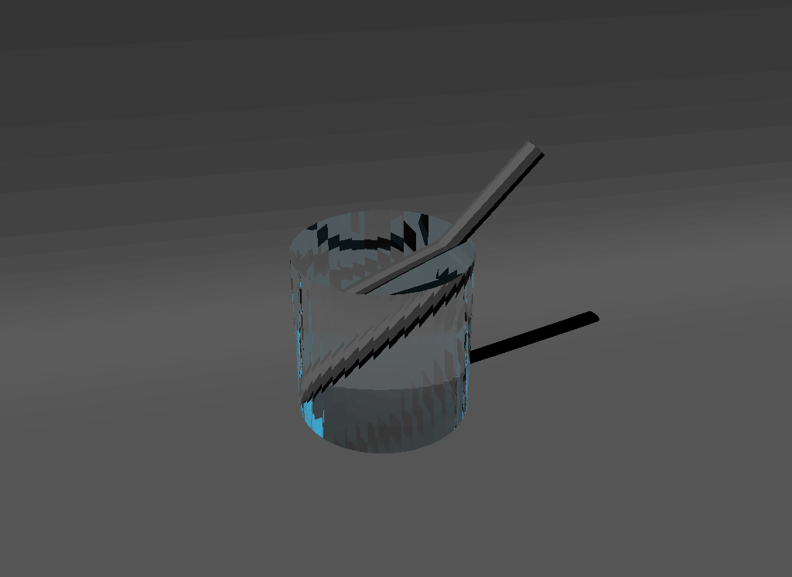
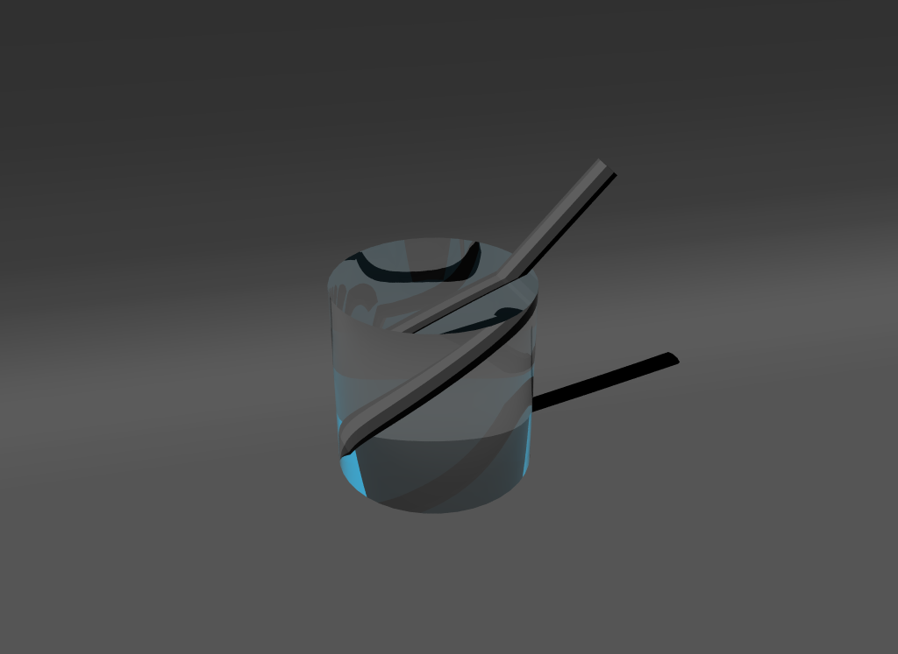
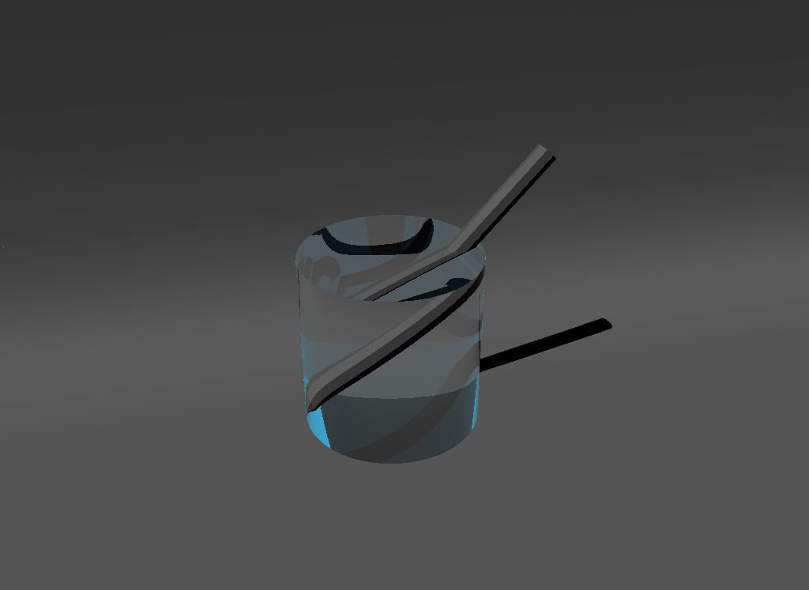

# Project Report - Hardware Accelerated Recursive Raytracing

[TOC]

## Abstract

In my project proposal I mentioned 3 goals I'm going to achieve in this project,

+ Learn the principle of refraction and its modeling
+ Learn techniques about ray tracing and implement realistic glass/water effect
+ Study one of the modern Graphics APIs that supports hardware accelerated ray tracing

Fortunately, although with a rough implementation, I did accomplish these goals.

I learned the refraction model, in 2 parts, how to determine the direction of a refraction ray, and how is the amount of light distributed among refraction and reflection, which are the Snell's law and the Fresnel equation.

After a simple survey among DirectX, Vulkan and Metal, I decided to study and use Vulkan because it can run across different operating systems (Windows & Linux). Also Vulkan is made and supported by NVIDIA, which is famous for its mature commercial ray tracing graphics cards - the RTX series.

Finally, I re-implemented the scene in this tutorial, [Introduction to Shading by Scratchapixel 2.0](https://www.scratchapixel.com/lessons/3d-basic-rendering/introduction-to-shading/reflection-refraction-fresnel), with a pen and a glass in it, using Vulkan's API on a ray tracing acceleration supported hardware.

<figure style="text-align: center">

<figcaption>Ray tracing with a pen and a glass cylinder, cited from scratchapixel.com</figcaption>
</figure>

In this report, I'm going to briefly discuss the models and techniques I learned and implemented, the problems I faced, my thoughts and the possible future works.

## Refraction Model

### Direction

The direction of a refraction light depends on the speed of light in this medium. Let denote the speed of light in a certain medium as $v$, then we have
$$
\eta = \frac{c}{v}
$$
$\eta$ is so-called **ior**, index of refraction. It's called the Snell's law that describes how is the refraction light directioned in the equation
$$
\frac{\sin\theta_1}{\sin\theta_2} = \frac{\eta_2}{\eta_1}
$$

<figure style="text-align: center">

<figcaption>Refraction ray direction, cited from scratchapixel.com</figcaption>
</figure>

Based on this equation, given ray and hit normal, and the ior of the surface, we'll be able to compute the refraction ray's direction.

### Amount

The fresnel equations tell us what's the amount of refraction and reflection lights,
$$
F_{R\parallel} = (\frac{\eta_2\cos\theta_1-\eta_1\cos\theta_2}{\eta_2\cos\theta_2+\eta_1\cos\theta_2})^2
$$

$$
F_{R\perp} = (\frac{\eta_1\cos\theta_2-\eta_2\cos\theta_1}{\eta_1\cos\theta_2+\eta_2\cos\theta_1})^2
$$

$$
F_R = \frac{1}{2}(F_{R\parallel} + F_{R\perp})
$$

$$
F_T = 1-F_R
$$

One thing to mention is there is total reflection when lights going to a medium with a lower ior. When we compute the direction of the refraction light, if there's no solution ($\sin\theta>1$), we do not have refractions and do not need to compute the fresnel equations.

## Vulkan API

As mentioned in the abstract, the reason I learned Vulkan was because mainly because it's cross-platformed.

The tutorial I followed was [vk_mini_path_tracer](https://nvpro-samples.github.io/vk_mini_path_tracer/), a beginner friendly tutorial made by NVIDIA. In this report I'd like to summarize essentially how to program with Vulkan and how Vulkan (with supported hardware) is fast in ray tracing.

Vulkan also uses GLSL, so writing shaders in Vulkan is very similar to writing it in OpenGL, with a C-based grammar, glm vectors & matrices. The difference is in Vulkan's shaders we can use extensions and API functions provided by Vulkan.

In addition to graphics pipelines (vertex shaders and fragment shaders), Vulkan provides compute pipelines (compute shaders) and ray tracing pipelines. Users can do ray tracing in either a compute pipeline (with ray query API) or a ray tracing pipeline. In this tutorial the author only demonstrated ray querying, and also I only implemented ray querying in a compute shader as in lack of time. Ray tracing pipelines are more cache-friendly, easier to recursive and more optimized.

A compute shader is a piece of code runs in a GPU thread, in which we can do any arbitrary computation. I believe the compute shader is invoked pixel-by-pixel, in parallel threads, simultaneously. In the main function of a compute shader we can get the coordinates of the current pixel we're rendering.

The data communication between the memory space and the GPU memory space shares the same spirit with OpenGL. We define buffers, and map them to the GPU memory. Defining these buffers and command pipelines takes a lot of boilerplate code (where we can define behaviors of buffers, like read-only), although I'm already using a helper library [nvpro](https://github.com/nvpro-samples/nvpro_core).

The different experience of programming a compute shader from the graphics pipeline is that, in the compute shader we can have a global access to all the vertices, and program any tiny details about how to compute the color for one pixel -- unlike in graphics pipelines most of the values are automatically interpolated by OpenGL.

I learned 3 reasons why is Vulkan fast, compared with Project 1 I did this semester and the Scratchapixel's tutorial,

1. It runs in parallel, at least for each pixel, while the CPU implementation only runs in a single thread.
2. Vulkan builds an acceleration data structure for triangles. With the help of this data structure, it can find the nearest intersect triangle with an efficient algorithm.
3. The computation of finding geometry intersections is implemented by hardware, so it will be very fast.

Whenever we need to find out a nearest intersection, we can call Vulkan's API like `rayQueryGetIntersectionTypeEXT` in our compute shader. The GPU will search over the acceleration data structure of our meshes and give the result. We can also assert that all objects are opaque to accelerate this process or use an API to set which objects are transparent and should be ignored during the tracing process.

The Vulkan's ray query API tells which triangle is the nearest intersection (or none), and the barycentric coordinate of the intersection point.

## Recursive Raytracing

I found that this pen in a glass picture very nice, and I was committed to re-implement this using Vulkan and GPU accelerated ray tracing. Here are a few issues I faced during developing the project.

### Diffuse Reflection Model

The tutorial [Ray Tracing In One Weekend](https://raytracing.github.io/books/RayTracingInOneWeekend.html) introduces a diffuse reflection model, which generates a distribution of reflection rays to various directions that the surface faces with, proceed ray tracing and compute the average of the resulted colors. This model simulates the diffuse reflection in the physical world, since ray querying is cheap now, this model inspired me a lot.

In the beginning, I implemented this model and it looks great, it generates a continuous, smooth color on the surface.

<figure style="text-align: center">

<figcaption>Generating a distribution of diffuse reflection ray, cited from RayTracingInOneWeekend</figcaption>
</figure>

However, as I continued on using this model, I found out that there are some issues,

1. This model cannot simulate a "close parallel light". In the example given by the tutorial, it shades the final ray by giving the sky a color. However, if we need some angled strong light source to express the hierarchy of illumination, I didn't find out a way to reach the effect by finding some distribution according to the angle between the normal and the light.
2. It's hard to make the shadow effect under a parallel light. In the example given by the tutorial, the opaque spheres have shadows, but these shadows are obscure. I didn't make it to generate a clear shadow under a parallel light source.
3. It's hard to integrate this model in a recursive ray tracing. Since a diffuse reflection can occur in any depth of the recursion, if we compute the diffuse reflection by shooting a bunch of rays and computing averages, our program will have a large exponent of complexity, and also be messy to code.

So finally I give up on this approach for diffuse reflections and switched back to the Lambertian model. Another reason is that I wanted to keep the algorithm the same as the CPU-based implementation by Scratchapixel and compare how much the performance is boosted by using Vulkan.

### Smoothing Normals

Although the mesh I used (one backdrop, one cylinder and one pen) has thousands of triangles, it still looks strange if we do ray tracing based on the triangle normals. I didn't realize that this is so important before I smoothed the surface by interpolating the vertex normals. 

<figure style="text-align: center">

<figcaption>Left: Triangle normals; Right: Smoothed by vertex normals</figcaption>
</figure>

### Recursive Ray Querying

It wasn't until I finished developing the shader that I found that GLSL doesn't allow recursive function calls. So I had to rewrite the recursive function to a stack (with a fixed length array), to do the recursive ray querying. 

### Anti-aliasing

I think it's good to mention that I learned an anti-aliasing technique for ray tracing from Vulkan's vk_mini_path_tracer, which is, for each pixel we're rendering, generate a random shift from the center of that pixel, ranging from 0.0 to 1.0. And for each pixel average the results from a bunch of these different rays. By doing this we can avoid the aliasing at the edge of an object in the scene. As we can see in the picture, this technique has a very good effect that eliminates aliasing.

<figure style="text-align: center">

<figcaption>Left: Without anti-aliasing; Right: Anti-aliasing by 64 rays / pixel</figcaption>
</figure>
## Program & Performance

### Environment

I tested the program on a Google Cloud virtual computer instance, with

+ Window Server 2019 Datacenter
+ Intel Xeon CPU @ 2.30GHz 2.30GHz (2 cores, 4 virtual processors)
+ NVIDIA Tesla T4
+ 15GB RAM

### How to build

You need to run the program on a computer with an NVIDIA graphics card that supports hardware accelerated ray tracing.

After cloning the project, make sure you have all submodules installed.

`git submodule update --init --recursive`

**On Windows:**

1. Install Visual Studio 2022
2. Open *x64 Native Tools Command Prompt for VS 2022*
3. cd to project root
4. `.\configure`, this downloads dependencies through vcpkg
5. `.\build`
6. To run, find executive under the `bin_x64\Release` folder
7. To develop, open `build\RayTracerX.sln`

### Render Result

<figure style="text-align: center">

<figcaption>Left: Reference; Right: Render with Vulkan without anti-aliasing</figcaption>
</figure>
The right picture above is rendered by the program I implemented with Vulkan. The left picture is rendered by a program by scratchapixel.com that does ray tracing only with a CPU thread, the source code can be found at https://www.scratchapixel.com/code.php?id=13&origin=/lessons/3d-basic-rendering/introduction-to-shading.

If we observe the 2 pictures carefully, we can see that there are tiny differences that show the Vulkan one is smoother and has fewer distortions. This is because I use 32 as the max recursion depth while the referenced one only uses 5.

### Performace

Based on one test on the above environment, it takes 1537.48s for the CPU based program to render, while it only takes 3.11s for our Vulkan based program. What's more, it doesn't seem to make a difference whether we set the max recursion depth to 5 or trace each pixel 64 times for anti-aliasing. So we can see that the GPU acceleration for ray tracing is significant.
